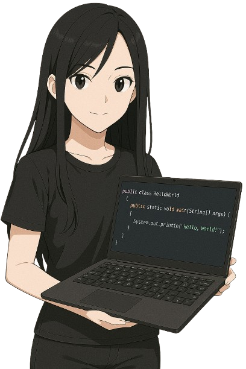

### Acadêmica de Ciência da Computação – IFCE

- Estudante dedicada, movida pela paixão por tecnologia e desenvolvimento de soluções inteligentes. 
- Explorando o universo da programação com ênfase em desenvolvimento FullStack. 
- Apaixonada por design web, unindo estética e funcionalidade. 
- Entusiasta de Inteligência Artificial e Machine Learning, sempre em busca de inovação.

---

### Stack atual:

  
  
  
  
  
  
  
  

---

### 📊 Estatísticas GitHub

---

### 🌐 Conecte-se comigo:

  
  

---

  

